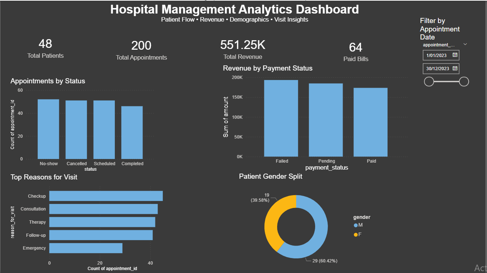

# Hospital Management Analytics Dashboard

## Project Overview
This project presents an end-to-end healthcare analytics dashboard built using Python, Jupyter Notebook, SQL-style joins, and Power BI.

The dashboard provides insights into patient appointments, billing performance, visit reasons, and patient demographics.

## Objectives
- Analyze appointment flow
- Monitor billing revenue
- Track payment completion
- Understand visit behavior
- Explore patient demographics

## Tools Used
- Python
- Pandas
- Jupyter Notebook
- Power BI
- GitHub

## Key Insights
- Total Patients: 48
- Total Appointments: 200
- Total Revenue: 551.25K
- Paid Bills: 64

## Dashboard Preview

## Key Visuals
- Appointments by Status
- Revenue by Payment Status
- Top Reasons for Visit
- Patient Gender Split

## Business Value
This dashboard can help hospital management teams monitor appointment efficiency, revenue flow, and patient visit trends for operational decision-making.

## Future Improvements
- doctor performance dashboard
- branch comparison
- treatment cost analysis
- monthly trend analysis
