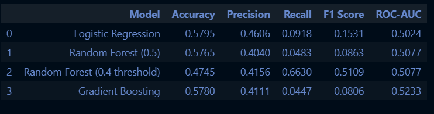
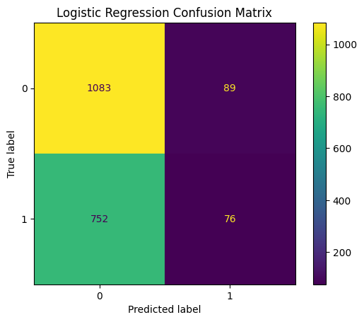
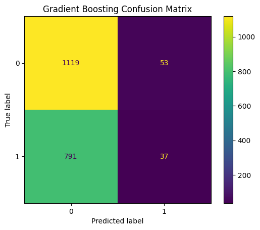
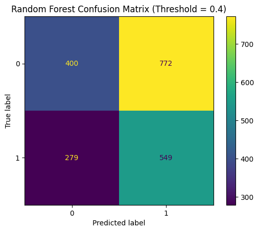
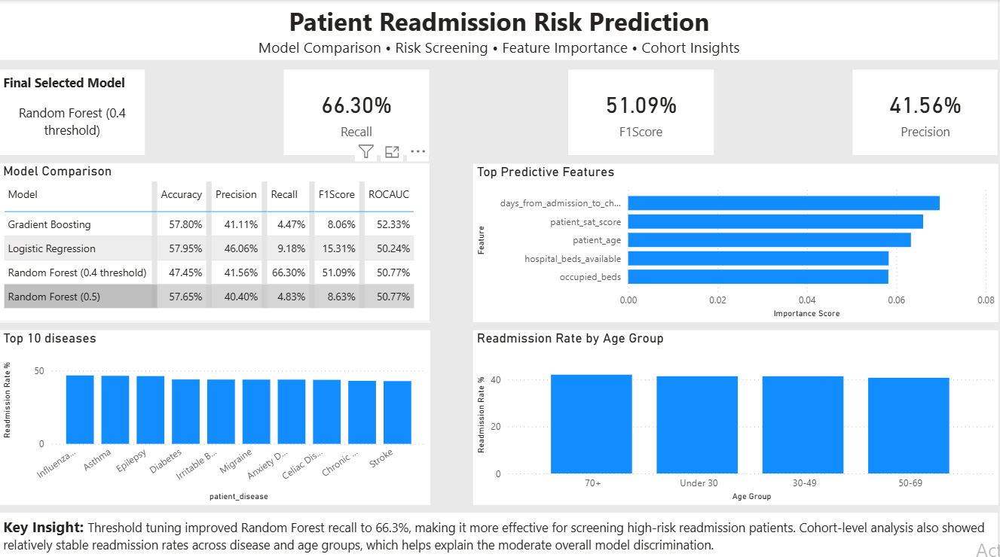

# Patient Readmission Risk Prediction

A healthcare analytics and machine learning project focused on predicting whether a patient is likely to be readmitted after discharge.

This project combines **data preprocessing, feature engineering, machine learning, SQL-based cohort analysis, and Power BI dashboarding** to build an end-to-end predictive analytics workflow.

---

## Project Objective

Hospital readmissions are a major operational and financial challenge in healthcare systems.

The objective of this project is to build a predictive model that can identify patients at higher risk of readmission so that hospitals can take preventive actions such as:

- follow-up care planning
- early intervention
- discharge support
- patient monitoring

---

## Dataset Overview

The dataset contains **10,000 patient-level hospital records** with information related to:

- hospital information
- ward and bed occupancy
- patient demographics
- disease type
- doctor specialty
- wait time
- length of stay
- discharge outcome
- readmission label

### Target Variable
```text
readmission
```

- `1` → readmitted
- `0` → not readmitted

---

## Project Workflow

### 1. Data Cleaning & EDA
Notebook: `01_data_cleaning_and_eda.ipynb`

Performed:

- missing value checking
- duplicate checking
- data type validation
- target distribution analysis
- numerical and categorical feature review

---

### 2. Feature Engineering
Notebook: `02_feature_engineering.ipynb`

Created engineered features such as:

- days from admission to check-in
- days from check-in to checkout
- admission month
- hour of day
- age groups
- encoded categorical variables

---

### 3. Model Building & Evaluation
Notebook: `03_model_building_and_evaluation.ipynb`

Models implemented:

- Logistic Regression
- Random Forest
- Gradient Boosting
- Threshold-tuned Random Forest

---

## Model Performance Summary

| Model | Accuracy | Precision | Recall | F1 Score | ROC-AUC |
|---|---:|---:|---:|---:|---:|
| Logistic Regression | 0.5795 | 0.4606 | 0.0918 | 0.1531 | 0.5024 |
| Random Forest (0.5) | 0.5765 | 0.4040 | 0.0483 | 0.0863 | 0.5077 |
| Random Forest (0.4 threshold) | 0.4745 | 0.4156 | 0.6630 | 0.5109 | 0.5077 |
| Gradient Boosting | 0.5780 | 0.4111 | 0.0447 | 0.0806 | 0.5233 |

### Final Selected Model
**Random Forest (0.4 threshold)**

Chosen because of its significantly improved **recall (66.3%)**, making it more effective for risk screening use cases.

---

## Key Model Visualizations

### Model Comparison


### Logistic Regression Confusion Matrix


### Gradient Boosting Confusion Matrix


### Random Forest (Threshold = 0.4)


---

## SQL-Based Cohort Analysis

SQL queries were used to perform cohort-level healthcare analytics, including:

- readmission rate by disease
- discharge status analysis
- ward-level analysis
- doctor specialty analysis
- age-group readmission trends
- average wait time analysis

SQL file:
```text
sql/readmission_queries.sql
```

---

## Power BI Dashboard

A one-page Power BI dashboard was created to communicate:

- final selected model
- KPI metrics
- model comparison
- top predictive features
- disease-level readmission trends
- age-group insights

### Dashboard Preview


---

## Key Insights

- threshold tuning significantly improved model recall
- disease and age-group readmission rates remained relatively stable
- cohort-level patterns explain moderate model discrimination
- feature importance highlighted:
  - days from admission to check-in
  - patient satisfaction score
  - age
  - bed occupancy

---

## Tech Stack

- Python
- Pandas
- NumPy
- Scikit-learn
- Matplotlib
- Seaborn
- MySQL
- Power BI

---

## Project Structure

```text
project-02-patient-readmission-risk-prediction/
│
├── notebooks/
├── sql/
├── powerbi/
├── outputs/
│   └── figures/
├── README.md
└── requirements.txt
```

---

## Business Value

This project demonstrates how machine learning and business intelligence tools can be integrated to support healthcare decision-making and patient risk screening workflows.

---

## Author

Md Ifthekher Uddin Chy